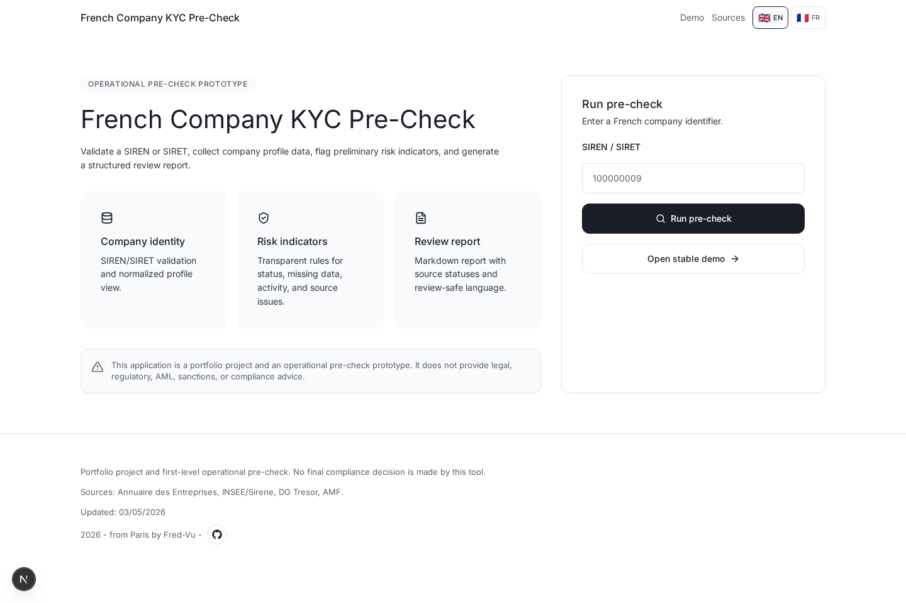
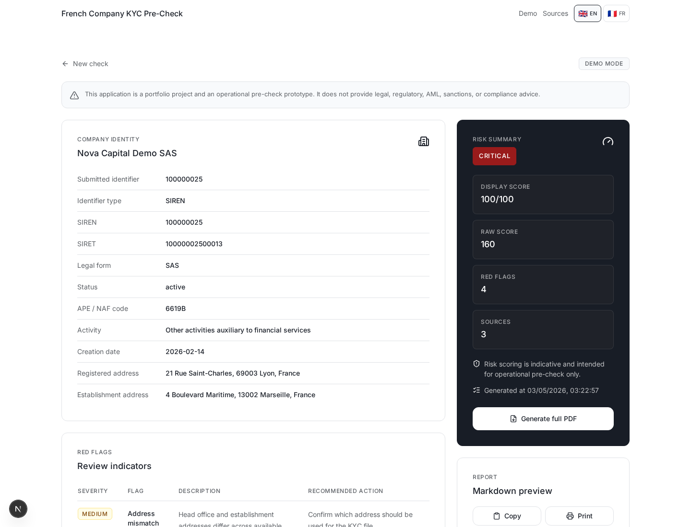
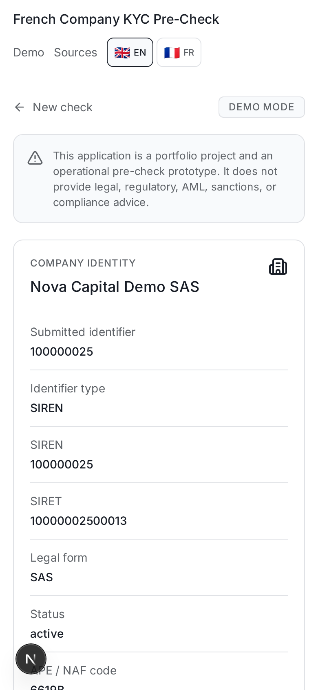

# French Company KYC Pre-Check Tool

Demo-first MVP for first-level French company KYC pre-checks.

The application validates SIREN/SIRET identifiers, resolves a company profile, applies transparent risk indicators, screens against public warning data when enabled, and generates a structured report for human review.

## Live Demo

Production: https://kyc-fr-pre-check.vercel.app/

## What Problem This Solves

Compliance and operations teams often need a fast first-pass view before opening a full KYC review. This tool turns a French SIREN/SIRET into a review-ready pre-check: company identity, source status, preliminary risk indicators, screening matches, data freshness, and a printable report.

The goal is not to automate a final decision. The goal is to make the first human review faster, clearer, and easier to audit.

## Screenshots

### Landing Page



### Pre-Check Result



### Mobile Result View



## Scope

This is an operational pre-check prototype. It does not make final KYC, AML, sanctions, legal, regulatory, or compliance decisions.

V1 is intentionally demo-first:

- `/demo` works without external APIs or credentials.
- Known demo identifiers resolve through deterministic fixtures.
- Live sources are optional enrichment.
- Source failures are shown as partial results instead of breaking the workflow.

## Demo Identifiers

| Scenario | SIREN | SIRET |
|---|---:|---:|
| Normal active company | `100000009` | `10000000900017` |
| Closed company | `100000017` | `10000001700010` |
| Inconsistent sensitive activity | `100000025` | `10000002500013` |

All demo company names are fictional.

## Features

- SIREN/SIRET validation with checksum.
- Demo fixtures for stable offline operation.
- Company identity dashboard.
- Transparent risk scoring and red flags.
- Demo and optional live source status tracking.
- English/French interface with a flag language selector.
- Conservative screening match language.
- Markdown report generation.
- Copy report and browser print export.
- English and French disclaimers.

## Architecture Summary

- **Next.js App Router** serves the portfolio UI, result pages, and API routes.
- **KYC orchestration** lives in `lib/kyc/run-precheck.ts`, combining identifier validation, company lookup, screening, red flags, scoring, and report generation.
- **Demo-first data path** keeps `/demo` and known fixtures stable without external API dependencies.
- **Live enrichment** uses Annuaire des Entreprises, AMF dataset resolution, and the committed DG Tresor local snapshot.
- **DG Tresor snapshot strategy** keeps `/api/precheck` fast by reading `data/dg-tresor-index.json`; a GitHub Action refreshes the snapshot weekly.
- **i18n layer** uses a lightweight English/French dictionary and a language cookie.
- **Verification** combines Vitest unit/integration tests and Playwright production smoke tests.

## Data Sources

V1 source priority:

1. Demo fixtures.
2. Annuaire des Entreprises / API Recherche d'Entreprises.
3. DG Tresor Gels des avoirs local snapshot.
4. AMF blacklists dataset.

External references:

- https://www.data.gouv.fr/dataservices/api-recherche-dentreprises
- https://www.data.gouv.fr/dataservices/api-gels-des-avoirs
- https://www.data.gouv.fr/datasets/listes-noires-des-entites-non-autorisees-a-proposer-des-produits-ou-services-financiers-en-france/

## Tech Stack

- Next.js App Router
- TypeScript
- Tailwind CSS
- Zod
- Vitest
- Lucide React
- Vercel-ready deployment

## Local Development

```bash
npm install
npm run dev
```

Open `http://localhost:3000`.

## Environment

Copy `.env.example` to `.env.local` for local overrides.

Default stable demo mode:

```env
ENABLE_DEMO_MODE=true
ENABLE_EXTERNAL_API_CALLS=false
```

Optional live enrichment:

```env
ENABLE_DEMO_MODE=true
ENABLE_EXTERNAL_API_CALLS=true
```

For AMF warning-list screening, leave `AMF_BLACKLIST_DATASET_URL` blank or set it to the stable data.gouv dataset API:

```env
AMF_BLACKLIST_DATASET_URL=https://www.data.gouv.fr/api/1/datasets/listes-noires-des-entites-non-autorisees-a-proposer-des-produits-ou-services-financiers-en-france/
```

Do not set it to the AMF public webpage URL, because that page returns HTML, not CSV.

DG Tresor screening uses the committed local snapshot in `data/dg-tresor-index.json`.
The snapshot is refreshed by `.github/workflows/refresh-dg-tresor.yml` every Monday at 04:00 UTC.
For local refreshes, run `npm run refresh:dg-tresor`.

## Scripts

```bash
npm run typecheck
npm test
npm run test:smoke:prod
npm run build
npm run refresh:dg-tresor
```

Production smoke tests default to `https://kyc-fr-pre-check.vercel.app`.
To run them against another deployment:

```bash
PLAYWRIGHT_BASE_URL=https://your-preview-url.vercel.app npm run test:smoke:prod
```

## Limitations & Compliance Disclaimer

This application is a portfolio project and an operational pre-check prototype. It does not provide legal, regulatory, AML, sanctions, or compliance advice. It does not replace official KYC procedures or human compliance review.

Cette application est un projet portfolio et un prototype de pre-verification operationnelle. Elle ne fournit pas de conseil juridique, reglementaire, AML, sanctions ou conformite. Elle ne remplace pas les procedures KYC officielles ni la revue humaine d'un analyste conformite.

Known limitations:

- Screening matches are conservative indicators, not verified sanctions or warning-list decisions.
- Public data sources can be unavailable, delayed, incomplete, or inconsistent.
- DG Tresor screening depends on the latest committed snapshot until the weekly refresh workflow runs.
- The AMF warning-list parser is designed for the public dataset shape and may need adaptation if the dataset schema changes.
- No authentication, audit trail, case assignment, or evidence storage is included in this MVP.
- Beneficial ownership, PEP screening, adverse media, and document verification are out of scope.

## Future Improvements

- Batch company checks.
- Authentication and audit trail.
- Beneficial ownership module.
- Full PDF generation.
- Dedicated rate limiting service for production deployments.
